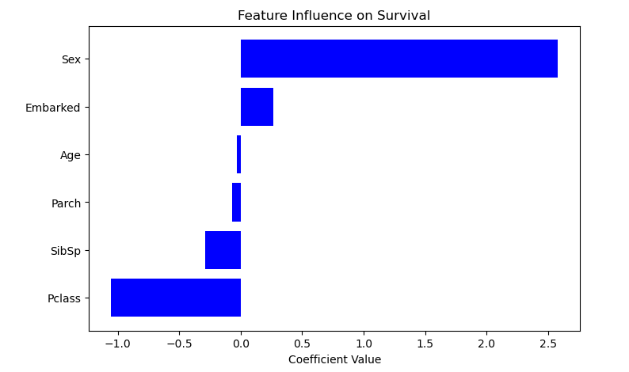

#  Titanic Survival Prediction - Machine Learning Project

##  Overview

This project predicts whether a passenger survived the **Titanic shipwreck** using the famous Kaggle dataset.  
The model uses **Logistic Regression** to classify survival (0 = Did Not Survive, 1 = Survived).

---

##  Objective

Train a machine learning model to predict survival based on:

- Passenger class (`Pclass`)
- Gender (`Sex`)
- Age (`Age`)
- Number of siblings/spouses aboard (`SibSp`)
- Number of parents/children aboard (`Parch`)
- Port of embarkation (`Embarked`)

---

##  Tools and Libraries

- Python
- Pandas, NumPy
- Matplotlib, Seaborn
- Scikit-learn

---

##  Project Workflow

### 1️⃣ Data Wrangling

The dataset is cleaned using a custom function `wrangle()`:

```python
import pandas as pd

def wrangle(file_path):
    df = pd.read_csv(file_path)
    df.drop(["PassengerId", "Ticket", "Fare", "Cabin"], axis=1, inplace=True)
    df["Age"].fillna(df["Age"].mean(), inplace=True)
    df["Age"] = df["Age"].round(0).astype(int)
    df["Embarked"].fillna(df["Embarked"].mode()[0], inplace=True)
    df["Sex"] = df["Sex"].map({"male": 0, "female": 1})
    df["Embarked"] = df["Embarked"].map({"S": 0, "C": 1, "Q": 2})
    return df

train = wrangle("data/train.csv")
test = wrangle("data/test.csv")
````

* Missing values in `Age` are filled with the mean.
* Missing values in `Embarked` are filled with the mode.
* Categorical variables (`Sex`, `Embarked`) are converted to numeric.
* Unnecessary columns (`PassengerId`, `Ticket`, `Fare`, `Cabin`) are dropped.

---

### 2️⃣ Baseline Model

We first calculate a **baseline prediction** using the mean survival rate:

```python
from sklearn.metrics import mean_absolute_error

y_mean = train["Survived"].mean()
y_pred_baseline = [y_mean] * len(train)
mae_baseline = mean_absolute_error(train["Survived"], y_pred_baseline)
print("Baseline MAE:", round(mae_baseline, 2))
```

* Baseline MAE gives a reference point for model performance.

---

### 3️⃣ Train–Validation Split

Split the data into training and validation sets:

```python
from sklearn.model_selection import train_test_split

features = ["Pclass", "Sex", "Age", "SibSp", "Parch", "Embarked"]
target = "Survived"

X = train[features]
y = train[target]

X_train, X_valid, y_train, y_valid = train_test_split(
    X, y, test_size=0.2, random_state=42
)

print("Training set shape:", X_train.shape)
print("Validation set shape:", X_valid.shape)
```

---

### 4️⃣ Logistic Regression Model

Train a **Logistic Regression** model:

```python
from sklearn.linear_model import LogisticRegression

model = LogisticRegression(max_iter=1000)
model.fit(X_train, y_train)
```

---

### 5️⃣ Model Evaluation

Evaluate performance on the validation set:

```python
from sklearn.metrics import accuracy_score, confusion_matrix, classification_report

y_pred = model.predict(X_valid)

print("Accuracy:", round(accuracy_score(y_valid, y_pred), 3))
print("\nConfusion Matrix:\n", confusion_matrix(y_valid, y_pred))
print("\nClassification Report:\n", classification_report(y_valid, y_pred))
```

---

### 6️⃣ Feature Importance

Check which features most influence survival:

```python
importance = pd.DataFrame({
    'Feature': X_train.columns,
    'Coefficient': model.coef_[0]
}).sort_values(by='Coefficient', ascending=False)

print(importance)
 
```



* Positive coefficient → increases survival probability.
* Negative coefficient → decreases survival probability.

* Sex is by far the most important feature — no surprise, survival was much higher among females.
* Pclass (ticket class) also matters a lot.
* Age has moderate importance.
* The rest (SibSp, Parch, Embarked) are relatively weak.

---

### 7️⃣ Model Validation Experiments

Evaluate model sensitivity by removing features:

```python
from sklearn.metrics import accuracy_score

for feature in X_train.columns:
    X_temp = X_train.drop(columns=[feature])
    model_temp = LogisticRegression(max_iter=1000)
    model_temp.fit(X_temp, y_train)
    acc = accuracy_score(y_valid, model_temp.predict(X_valid.drop(columns=[feature])))
    print(f"Accuracy without {feature}: {acc:.3f}")
```

* Removing `Sex` reduces accuracy the most, confirming its importance.

---

### 8️⃣ Correlation Analysis

Check correlations between features and survival:

```python
corr = train.corr(numeric_only=True)["Survived"].sort_values(ascending=False)
print(corr)
```

* `Sex` positively correlates with survival.
* `Pclass` negatively correlates — higher class passengers more likely to survive.

---

### 9️⃣ Predictions on Test Data

```python
X_test = test[features]
test_predictions = model.predict(X_test)
test["Survived"] = test_predictions
```

---

### 🔟 Visualization — Predicted Survival

```python
import matplotlib.pyplot as plt
import pandas as pd

counts = pd.Series(test_predictions).value_counts().sort_index()

plt.figure(figsize=(5, 5))
plt.pie(
    counts,
    labels=["Did Not Survive (0)", "Survived (1)"],
    autopct="%1.1f%%",
    startangle=90,
    colors=["blue", "orange"],
    explode=(0.05, 0.05)
)
plt.title("Predicted Survival Distribution (Test Dataset)")
plt.show()
```


* This pie chart shows the predicted survival outcomes from our model on the test dataset:

* Did Not Survive (0): 63.2% → The model predicts that the majority of passengers in the test set would not survive.

* Survived (1): 36.8% → A smaller portion of passengers are predicted to survive.

---

---

##  Results Summary

* **Model Used:** Logistic Regression
* **Validation Accuracy:** ~81%
* **Key Predictors:** Gender, Passenger Class, Age
* **Less Important Predictors:** Embarked, Parch

---

## 🚀 Future Improvements

* Try **Random Forest** or **XGBoost** for non-linear relationships.
* Perform **hyperparameter tuning** using GridSearchCV.
* Use **cross-validation** for more robust performance evaluation.

---


---

## 👩‍💻 Author

**Lauryn Mwendwa**
*Data Scientist*
📧 [laurynmwendwa26@gmail.com](mailto:laurynmwendwa26@gmail.com)

```

---
